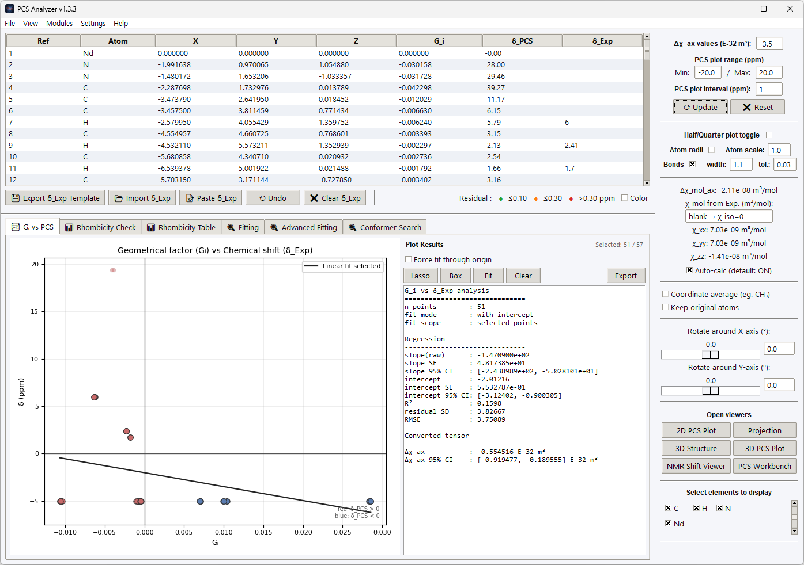
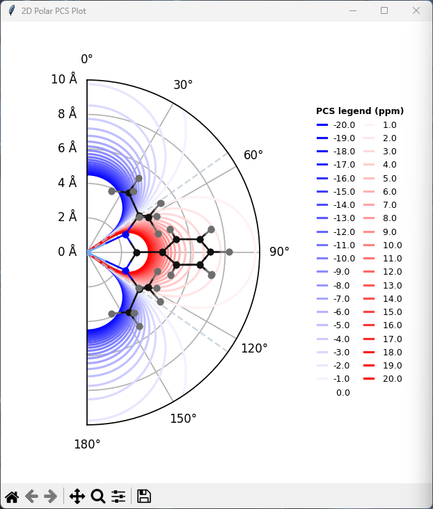
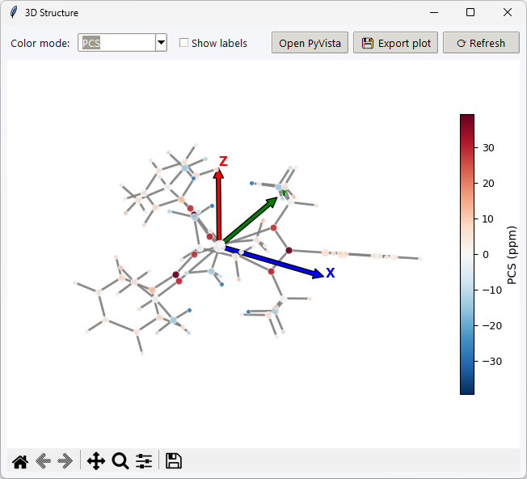
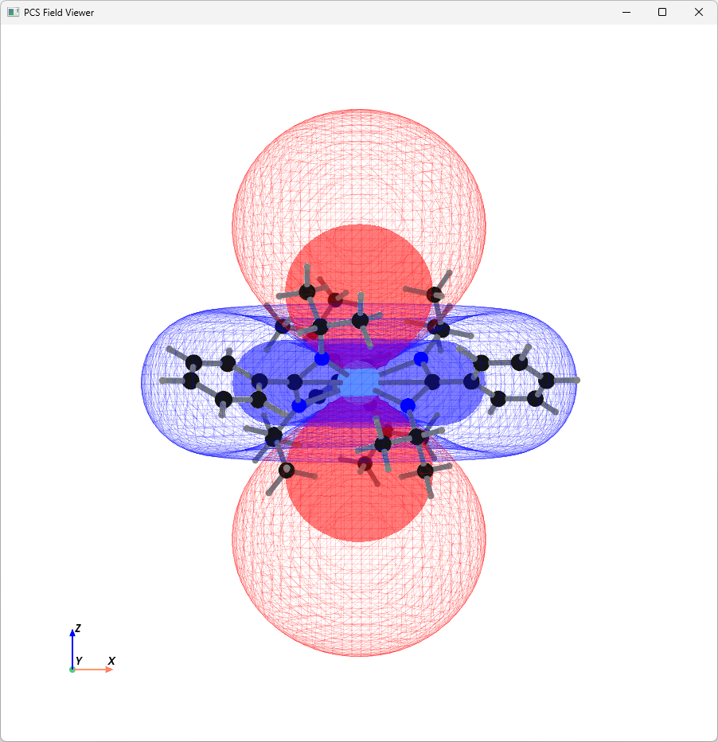
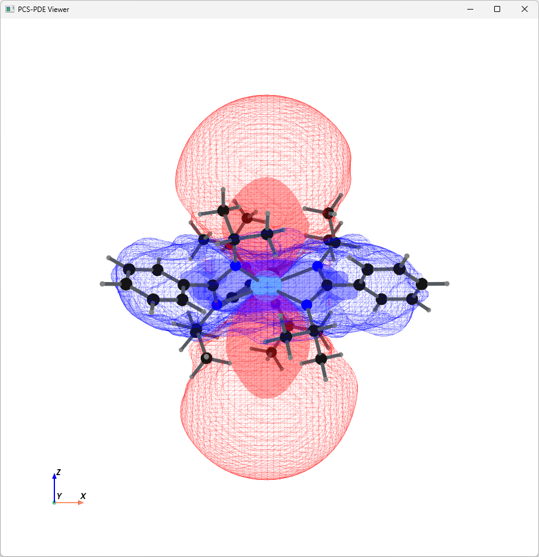
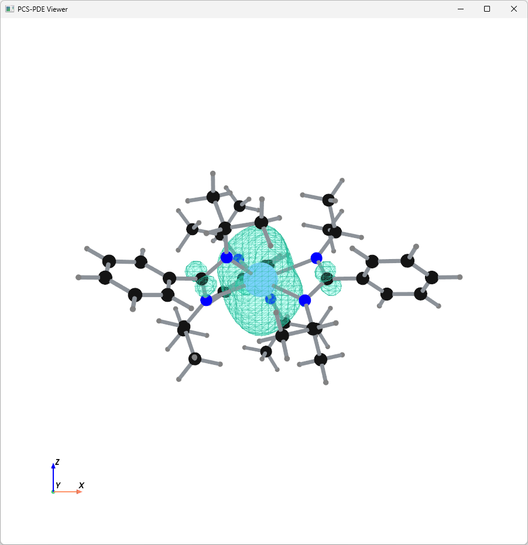
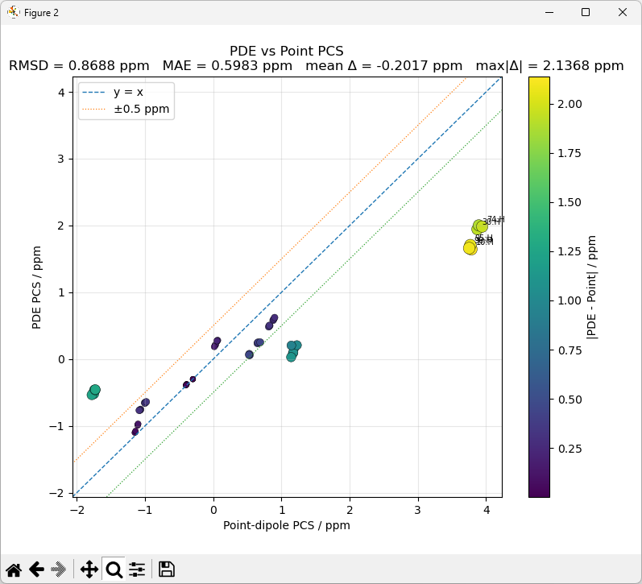

# PCS Analyzer

**PCS Analyzer** is a Python-based application for the analysis, fitting, and visualization of **pseudocontact shifts (PCS)** in paramagnetic molecular systems.

It provides an integrated workflow that connects molecular structure, magnetic susceptibility anisotropy, and experimental NMR shift data.

-   :material-molecule:{ .lg .middle } **Structure-based analysis**

    Load molecular geometries and evaluate PCS in a defined molecular or tensor coordinate frame.

-   :material-chart-scatter-plot:{ .lg .middle } **PCS fitting and diagnostics**

    Compare experimental and calculated shifts, optimize tensor parameters, and inspect fitting residuals.

-   :material-axis-arrow:{ .lg .middle } **Scientific visualization**

    Explore PCS distributions using polar, Cartesian, projection, and three-dimensional representations.

## Main interface

<figure>
  
  <figcaption>PCS Analyzer main interface.</figcaption>
</figure>

## Typical workflow

A PCS analysis generally follows four steps:

1. **Load a molecular structure**  
   Import a molecular geometry from an XYZ file or supported ORCA output.

2. **Define the magnetic susceptibility tensor**  
   Specify the axial susceptibility anisotropy and, when required, the rhombic component and tensor orientation.

3. **Add experimental NMR data**  
   Assign experimental paramagnetic or PCS shift values to the corresponding nuclei.

4. **Analyze, fit, and visualize**  
   Compare calculated and experimental shifts, perform fitting or diagnostic analysis, and inspect the resulting PCS distribution.

[Quick Start](quick-start.md){ .md-button .md-button--primary }
[Installation](installation.md){ .md-button }

## Visualization

-   

    **2D Polar PCS Plot**

    Angular representation of the PCS field for inspection of axial contributions.

    [Learn more](visualization/polar-plot.md)

-   

    **3D Viewer**

    Three-dimensional visualization of molecular geometry, with optional inspection of rhombic contributions when a rhombic susceptibility component is included.

    [Learn more](visualization/3d-viewer.md)

-   

    **3D PCS Isosurface Plot**

    Three-dimensional visualization of PCS isosurfaces around the molecular structure.

    [Learn more](visualization/3d-pcs-isosurface.md)

-   

    

    **PCS Workbench**

	Integrated workspace for PCS analysis combining molecular structures and ORCA outputs, with PCS-field and spin-density visualization and paramagnetic NMR diagnostics.

    [Learn more](visualization/pcs-workbench.md)

## Analysis capabilities

PCS Analyzer includes tools for:

- molecular structure import and coordinate handling
- axial and rhombic PCS calculations
- magnetic susceptibility tensor analysis
- comparison of calculated and experimental shifts
- tensor and orientation fitting
- residual and rhombicity diagnostics
- 2D and 3D PCS visualization
- NMR-oriented analysis tools
- conformational analysis and PCS-guided conformer search

## PCS model

PCS Analyzer is primarily designed for approximately rotational molecular geometries, where the magnetic susceptibility tensor can often be treated as effectively axial.

In this default case, the PCS contribution is written as

$$
\delta_{\mathrm{PCS}}\;(\mathrm{ppm})
=
\frac{10^4}{12\pi}
\Delta\chi_{\mathrm{ax}}
G_{\mathrm{ax}},
$$

with

$$
G_{\mathrm{ax}}
=
\frac{3\cos^2\theta-1}{r^3}.
$$

Here, \(r\) is the distance from the paramagnetic centre to the observed nucleus and \(\theta\) is the polar angle relative to the principal \(z\)-axis.

For systems where rhombicity cannot be neglected, PCS Analyzer can include the rhombic contribution and use the full axial–rhombic expression,

$$
\delta_{\mathrm{PCS}}\;(\mathrm{ppm})
=
\frac{10^4}{12\pi}
\left(
\Delta\chi_{\mathrm{ax}}G_{\mathrm{ax}}
+
\Delta\chi_{\mathrm{rh}}G_{\mathrm{rh}}
\right),
$$

where

$$
G_{\mathrm{rh}}
=
\frac{3}{2}
\frac{\sin^2\theta\cos(2\phi)}{r^3},
$$

and \(\phi\) is the azimuthal angle in the \(xy\)-plane.

Thus, the axial model is used as the default representation, while the rhombic term can be included when deviations from effective rotational symmetry are significant.

!!! note "Tensor conventions"

    PCS Analyzer defines

    \[
    \Delta\chi_{\mathrm{ax}}
    =
    \chi_{zz}
    -
    \frac{\chi_{xx}+\chi_{yy}}{2},
    \]

    and

    \[
    \Delta\chi_{\mathrm{rh}}
    =
    \chi_{xx}-\chi_{yy}.
    \]

    In PCS calculations, \(\Delta\chi_{\mathrm{ax}}\) and \(\Delta\chi_{\mathrm{rh}}\) are entered in units of \(10^{-32}\,\mathrm{m^3}\) per molecule, with molecular coordinates in Å.

    The \(z\)-axis defines the principal axial direction, while the \(x\) and \(y\) axes define the orientation of the rhombic contribution.

See [Tensor Conventions](pcs/tensor-conventions.md) and [Mathematical Conventions](reference/mathematical-conventions.md) for detailed definitions and unit conversions.

## Documentation

New users may want to begin with:

- [Installation](installation.md)
- [Quick Start](quick-start.md)
- [Interface Overview](interface.md)

For the theoretical and numerical definitions used by the program:

- [PCS Theory](pcs/theory.md)
- [Tensor Conventions](pcs/tensor-conventions.md)
- [Mathematical Conventions](reference/mathematical-conventions.md)

## Extending PCS Analyzer

PCS Analyzer supports external plugins for adding custom analysis tools, viewers, fitting utilities, and research-specific workflows.

[Plugin Documentation](plugins/overview.md){ .md-button }

## Citation

PCS Analyzer is research software developed for the analysis, fitting, and visualization of pseudocontact shifts in paramagnetic molecular systems.

Archived releases of PCS Analyzer are available through Zenodo:

[**PCS Analyzer on Zenodo**](https://doi.org/10.5281/zenodo.18752129){ .md-button }

Please cite the archived Zenodo release when using PCS Analyzer in academic work.

!!! info "Manuscript"
    A dedicated software description manuscript presenting the implementation, methodology, and scientific applications of PCS Analyzer is currently in preparation.